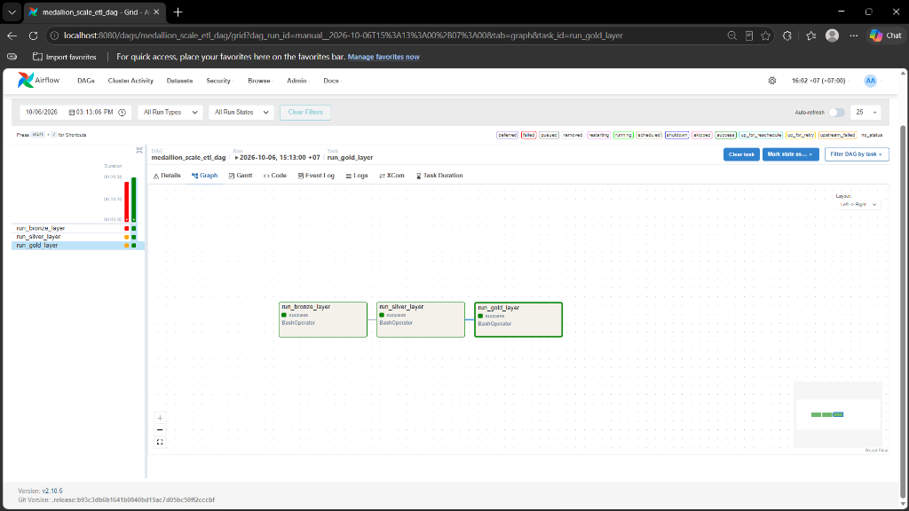

# Kiến trúc Data Lakehouse ETL - Quy mô 1M đến 100M

Tài liệu này mô tả quy trình thực thi kiến trúc Medallion (Bronze - Silver - Gold) cho dự án và các kỹ thuật xử lý dữ liệu ở quy mô lớn (1M - 100M rows).

## 1. Yêu cầu thiết kế khi mở rộng quy mô (Scale-up)

### Thành phần tái sử dụng từ quy trình nhỏ
- **Data Cleansing:** Các phép biến đổi cơ bản (ví dụ: `upper(trim())`), ép kiểu (`try_to_date`), gán giá trị mặc định (`fillna`) được giữ nguyên.
- **Quarantine/Invalid Orders:** Cơ chế kiểm toán dữ liệu vi phạm điều kiện nghiệp vụ (âm tiền, null ngày tháng). Dữ liệu lỗi được chuyển vào thư mục riêng biệt để phân tích thay vì bị loại bỏ hoàn toàn.
- **Enrichment:** Phân loại và tạo cột mới phục vụ báo cáo.

### Yêu cầu thay đổi ở quy mô 1M - 100M rows
1. **Memory Tuning:**
   - Cấu hình bắt buộc: Cấp phát tài nguyên rõ ràng thông qua `.config("spark.driver.memory", "8g")` và `spark.executor.memory`. Thiết lập mặc định của Spark có thể dẫn đến lỗi Out-of-Memory (OOM) khi thực hiện Shuffle trên tập dữ liệu lớn.
2. **Deduplication & Shuffle Management:**
   - Sử dụng hàm `Window` để lọc trùng lặp yêu cầu quá trình Shuffle. Cần thiết lập `spark.sql.shuffle.partitions` (ví dụ: 200) để phân bổ khối lượng công việc, tránh hiện tượng Data Skew và giảm thiểu rủi ro nghẽn cổ chai.
3. **Partitioning:**
   - Khi ghi dữ liệu ở lớp Silver, cần thiết lập `partitionBy("order_year", "order_month")`. Tính năng này cho phép cơ chế Partition Discovery hoạt động ở các bước tiếp theo, loại bỏ thao tác full-scan toàn bộ file.
4. **Điều phối tài nguyên (Resource Orchestration):**
   - Hoạt động I/O và CPU đạt mức tối đa ở quy mô 100M rows. Yêu cầu sử dụng hệ thống lên lịch (như Apache Airflow) để đảm bảo các tiến trình được chạy tuần tự, tránh tranh chấp tài nguyên hệ thống.

---

## 2. Luồng quy trình ETL (Medallion Architecture)

### Lớp Bronze (Raw Ingestion)
- **File phụ trách:** `etl_bronze.py`
- **Mục tiêu:** Nạp dữ liệu thô từ hệ thống nguồn (Source System) vào kho lưu trữ.
- **Hoạt động:** Đọc các file `.parquet` từ thư mục `raw`, duy trì cấu trúc Schema ban đầu, ghi nhận metadata (số lượng bản ghi) và lưu vào `lakehouse/bronze`.

### Lớp Silver (Cleansing, Quarantine & Enrichment)
- **File phụ trách:** `etl_silver.py`
- **Mục tiêu:** Cung cấp "Single Source of Truth". Dữ liệu được làm sạch và chuẩn hóa phục vụ phân tích.
- **Hoạt động:**
  1. **Deduplicate:** Loại bỏ các bản ghi trùng lặp thông qua `Window` function, giữ lại bản ghi có `order_timestamp` mới nhất.
  2. **Quarantine:** Các bản ghi vi phạm quy tắc (`total_amount <= 0`, `quantity < 1`, `order_date is null`) được định tuyến sang thư mục `silver/invalid_orders`.
  3. **Enrichment:** Phân loại `order_level` (HIGH/MEDIUM/LOW), chuẩn hoá chuỗi văn bản (`status`), và trích xuất dữ liệu thời gian (`order_year`, `order_month`).
  4. **Write:** Ghi dữ liệu hợp lệ vào `silver/orders` sử dụng `partitionBy`.

### Lớp Gold (Aggregations & Reporting)
- **File phụ trách:** `etl_gold.py`
- **Mục tiêu:** Cung cấp các Data Mart phục vụ trực tiếp cho báo cáo và BI Dashboard.
- **Hoạt động:**
  - `customer_360`: Tổng hợp chân dung khách hàng (tổng chi tiêu, số lượng đơn hàng, đơn hàng giá trị cao nhất).
  - `category_performance`: Thống kê doanh thu và sản lượng theo danh mục.
  - `shipping_performance`: Tính toán thời gian giao hàng, phân loại `Is_Late_Delivery` và phí vận chuyển trung bình.
---

## 3. Điều phối tự động với Apache Airflow (Orchestration)

Để đảm bảo các tiến trình Spark xử lý dữ liệu khổng lồ (100M rows) được chạy theo đúng thứ tự tuyến tính và tránh tranh chấp tài nguyên, hệ thống áp dụng **Apache Airflow** để điều phối (Orchestration) luồng ETL thay vì chạy thủ công.

### Thiết kế DAG (`medallion_scale_etl_dag`)
Toàn bộ luồng được định nghĩa trong file `dags/etl_scale_dag.py` với cấu trúc nối tiếp:
1. `run_bronze_layer` (BashOperator): Thực thi kịch bản `etl_bronze.py`. Kích hoạt đầu tiên để đưa dữ liệu Raw vào lớp Bronze.
2. `run_silver_layer` (BashOperator): Đợi Bronze thành công mới bắt đầu. Đây là tiến trình chịu tải nặng nhất do phải thao tác Shuffle loại bỏ trùng lặp và phân vùng (Partitioning) toàn bộ 100M dòng.
3. `run_gold_layer` (BashOperator): Kích hoạt cuối cùng khi Silver đã chuẩn hóa xong dữ liệu, thực hiện Join/Aggregate ra 3 bảng báo cáo cuối cùng.

### Cơ chế Tham số hóa (Parametrization)
DAG được thiết kế linh hoạt bằng cách sử dụng `{{ params.scale }}`. Khi người dùng bấm **Trigger DAG w/ config** trên giao diện Airflow, họ có thể truyền vào biến `{"scale": "100m"}` (hoặc `1m`, `10m`). DAG sẽ tự động định tuyến đường dẫn cho toàn bộ các script Spark để trỏ đúng vào kích cỡ tệp dữ liệu mong muốn mà không cần sửa code.

### Quản trị rủi ro & Restartability (Khả năng chạy lại)
- **Khắc phục nghẽn tài nguyên:** Xử lý 100 triệu dòng dễ dẫn đến hiện tượng quá tải (RAM/Disk I/O). Nếu một task bị lỗi (văng OOM hoặc đứt kết nối), Airflow sẽ khoanh vùng lỗi tại chính task đó (màu đỏ - Failed hoặc màu vàng - Up_for_retry). 
- **Tính luỹ đẳng (Idempotency):** Code Spark được thiết lập sử dụng `mode("overwrite")`. Nhờ vậy, khi xử lý lỗi, người vận hành chỉ việc bấm nút **Clear** trên giao diện Airflow tại task bị hỏng để chạy lại. Hệ thống sẽ ghi đè dữ liệu mới lên dữ liệu lỗi mà không lo bị nhân bản (duplicate) các dòng dữ liệu.

---

### Kết quả chạy DAG

